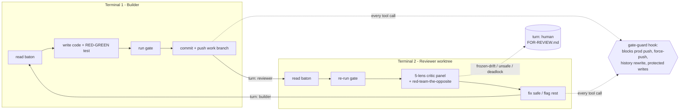

# autonomy-loop

**Two to four Claude Code terminals on one repo pass a git baton: a builder and an adversarial reviewer, plus an optional planner and researcher, gated by a frozen-invariant safety hook and a no-fabrication rule.** A plugin you drop into any project and tune from one config file. Free, MIT.

> Honest framing: the idea of a self-driving builder/reviewer loop is not new (see [Prior art](#prior-art)). What this gives you is a specific, opinionated discipline - an adversarial multi-lens reviewer, a frozen-invariant gate, and a no-fabrication rule - wired together and tunable per project. The value is in the constraints, not the novelty.

---

## What it is

Two terminals run `claude` in a `/loop` against the **same repo on different git worktrees**, passing a baton:

- **Builder.** Picks up the next task, writes code plus a RED-before / GREEN-after test, runs the gate, commits to the work branch, hands off.
- **Reviewer.** Re-runs the gate itself, spawns a **5-lens critic panel** (correctness, honesty, regression, security, UX), red-teams the opposite, fixes what is safe, flags the rest, hands back.

They never talk in chat. The only shared state is a committed file, `LOOP-STATE.md`, holding the baton (whose turn, the last SHAs, the next instruction each way). State lives in git, so a crash just resumes from the last commit. Add a **Planner** (and a **Researcher**) to feed researched, gated specs into the loop before they cost a build cycle - see [the three shapes](#the-three-shapes).



## Quickstart

```bash
# 1. add the marketplace + install (inside Claude Code)
/plugin marketplace add https://github.com/inferencegod/autonomy-loop
/plugin install autonomy-loop@autonomy-loop

# 2. scaffold the config + baton in your project
/autonomy-loop:autonomy-init

# 3. launch the loop, one role per terminal
#    Terminal 1:  claude  ->  /autonomy-loop:builder    ->  /loop 600
#    Terminal 2 (review worktree):  claude  ->  /autonomy-loop:reviewer  ->  /loop 600
```

`/loop 600` self-schedules a tick every 600 seconds. `/autonomy-init` writes `autonomy.config.json` (branches, gate commands, protected paths) and hands you the exact `git worktree add` line for the reviewer. The baton starts at `turn: human`; flip it to `turn: builder` to begin. First-run gotchas are in [Operate](#operate-first-run).

## The three shapes

The loop is **presence-driven**: you pick the shape by which terminals you launch. Each role signs into a shared roster on its first tick, so the Builder and Reviewer route by who is live (a missing planner is a deadlock-safe fallback to the builder, never a wedge). `roles.<role>: "off"` is the only veto.

- **2 terminals (default).** Builder + Reviewer. When the backlog drains, the Builder invents its own next move (MODE A).
- **3 terminals (recommended).** Add `/autonomy-loop:planner`. The Planner researches across lenses (product gaps, competitors, SEO, pricing, UX), grills one spec into a detailed doc with falsifiable **acceptance criteria** and a build-ready prompt, and the Reviewer screens it (sourced? has an acceptance test? scoped? risk tier? real ROI?) before the Builder may touch it.
- **4 terminals (power mode).** Also add `/autonomy-loop:researcher`. Research splits into its own terminal feeding an idea pool on a parallel baton (a durable git-common-dir sidecar), for a deep, always-full spec queue.

The keystone rule: **every spec ships a falsifiable acceptance test.** That is the ground-truth signal the gate checks against; a planning layer without it is just a faster way to be wrong. Non-code research (battlecards, positioning, pricing) is drafted to `GROWTH.md` and parked for you to publish.

## What makes it rigorous

A deterministic floor under every LLM judgment, on by default (a gate that ships toggled off is, for almost every user, a gate that does not exist). Each is a pure decision core with unit tests and a thin runner, no external deps.

- **An adversarial reviewer.** Its only win condition is finding fault. It re-runs the gate from scratch (never trusts "tests pass"), spawns role-specialized critics, and must argue why the change is wrong before it can approve.
- **A mechanized bite.** For each fix, the reviewer reverts the change in a throwaway worktree and reruns the new test; if the test still passes, it caught nothing and the wave fails. Brand-new code with nothing to revert routes to a **greenfield mutation-bite** that mutates the new lines and requires your test to kill a mutant. Fail-closed: never a pass without a recorded killed mutant or a clean RED.
- **A frozen invariant.** You declare what must stay byte-identical (golden/snapshot tests, a recorded API contract). Drift requires a human GO; the loop escalates, it never silently re-baselines.
- **A coverage ratchet + patch coverage.** Line and branch coverage each sit on a floor that only ratchets up, so the tree cannot quietly erode over hundreds of waves; patch coverage proves the lines each wave changed are themselves tested. Opt-in, see [Coverage](#coverage-opt-in).
- **Oracle-strength gates.** A weak-assertion detector and an acceptance-test mutation-kill gate fail a test that runs a line but pins nothing about it.
- **A money-path floor.** Any change touching billing, payments, migrations, auth, secrets, or data-deletion PARKS for an explicit human GO. The model cannot override it.
- **A convergence terminator.** When the builder and reviewer keep trading the same failure signature, it re-scopes, escalates to a stronger model, then parks - the bounded third vote that ends silent back-and-forth.
- **A no-fabrication rule.** Every number a build emits carries its sample size and interval, or says "building - N/30." A capability with no real data abstains visibly instead of inventing a value.
- **A quarantined researcher.** Fetched web content is typed-extracted so it cannot smuggle a spec past the gate, verified against an injection corpus that zero payloads pass.

## Security: rings and trust tiers

The agent and the things that guard it must not share one writable trust domain (a builder that can edit its own gate, forge the reviewer's lease, or reach prod is no gate at all). The plugin splits that domain into rings and adopts one rule: **provision each ring it can, or refuse to run unattended without it.**

- **A preflight prober** (`SessionStart`) measures the *real* assurance of your setup on every start - is the control plane writable by the agent's uid, is prod protected by a no-bypass server ruleset, is the reviewer a genuinely separate principal that is actually alive - and classifies a trust tier, feeding the detected tier into a fail-closed promotion floor instead of a self-reported lease.
- **A read-only control plane.** `harden-control-plane` materializes then locks every protected path, and a sandboxed shell makes an out-of-allow-list write fail at the OS layer regardless of interpreter or `cd`. The sandbox config sits outside the writable set so the agent cannot self-disable it.
- **A provisioned prod rail.** `/autonomy-init` sets a no-bypass branch ruleset on `prodBranch` (require a PR, block force-push and deletion, empty bypass list so it binds even admins).
- **Refuse-by-default.** Unattended auto-promotion is refused below the hardened tier; an attended local run can proceed lower only via an explicit, logged `--i-accept-reduced-assurance` escape hatch. No silent downgrade.

| Tier | Verifies | Auto-promotion |
|---|---|---|
| **T0 ATTESTED** | same uid, control plane writable | refused, attended only |
| **T1 LIVENESS** | reviewer provably alive, control plane locked, same principal | refused unattended |
| **T2 SEPARATED** | reviewer a different uid/SID and live, control plane read-only, repo-scoped credential | allowed, local-trust |
| **T3 HARDENED** | forge required-review ruleset the builder token cannot bypass, sandboxed checkout | allowed, unattended |

Honest about the residuals: a same-uid local setup can only be raised, never closed, by signing or liveness; the forge (T3) is the only unattended-grade independence; the regex gate-guard is a tripwire, not a vault. POSIX hardening ships first; on Windows the preflight points you at the devcontainer / WSL or the forge tier. See [SECURITY.md](SECURITY.md) for the full model, the tier table, and the residual map.

> **The gate-guard hook is a defense-in-depth tripwire, not a sandbox.** It blocks the common-case dangerous actions (prod pushes from any remote, force-push, history rewrite, protected-path writes) and returns a structured denial the model escalates on, but it cannot anticipate every trick and is not reliably enforced for sub-agent tool calls. The real backstops are server-side branch protection on `prodBranch`, read-only permissions on frozen files, and a disposable checkout. The hook reduces blast radius; your infra contains it.

## Configure

Copy `autonomy.config.example.json` to `autonomy.config.json` at your repo root. Key knobs:

| knob | what it does |
|---|---|
| `workBranch` / `prodBranch` | the loop only ever pushes `workBranch`; `prodBranch` is gated |
| `worktreePath` | where the Reviewer's worktree lives |
| `gate.test` / `gate.build` / `gate.lint` | your real commands - the reviewer re-runs them |
| `gate.frozenInvariant` | what must stay byte-identical without a human re-baseline |
| `gate.coverage` / `gate.patchTarget` | optional coverage ratchet + patch-coverage gates (see below) |
| `protectedPaths` | edits and shell writes (`rm`/`mv`/`cp`/redirect/`sed -i`) here are blocked; the defaults also protect the loop's own config, coverage baseline, and hooks so it cannot disarm itself |
| `roles.<role>` | `auto` / `required` / `off` - the only reason to edit roles (the shape is presence-driven) |
| `models.builder` / `reviewerCritics` / `reviewerJudge` | builder + cheap critics + escalation judge |
| `honestyRule` | the anti-fabrication contract injected into both prompts |

## Coverage (opt-in)

Coverage is a third and fourth gate on top of the bite. Set `gate.coverage` to a command that writes an Istanbul `coverage-summary.json`:

```jsonc
// autonomy.config.json
"gate": { "coverage": "c8 --reporter=json-summary --reporter=json --reporter=text npm test", "patchTarget": 100 }
```

The ratchet (`hooks/coverage-ratchet.mjs`) blocks any wave that lowers line or branch coverage and bumps the floor on a real improvement, so the whole tree cannot erode. Patch coverage (`gate.patchTarget`: 0 off, 80 standard, 100 strict) scores only the lines a wave changed, so new untested code cannot hide behind a flat global percent. Both work out of the box if your repo already reports coverage (jest, vitest, or `node --test` on Node 22+); otherwise add `c8`. With no coverage tool, both stay off and the loop still runs on the bite, the reviewer, and the safety hook.

## Operate (first run)

A minute of setup avoids the common failure modes:

- **Two terminals, not one.** The whole model is a builder and a reviewer passing a baton. One terminal is not the loop.
- **The reviewer runs in its own git worktree.** `/autonomy-init` hands you the exact `git worktree add` command; run the reviewer from there so the two never step on each other.
- **Start green.** Make sure your test/build/lint pass on a clean checkout before you launch. The gate reverts any wave that goes red, so a repo that starts red will look like the loop is undoing your code.
- **Approve the first task.** After init the baton sits at `turn: human`; flip it to `turn: builder` to start. Nothing runs until you do.
- **How to stop it.** Set `turn: human` in `LOOP-STATE.md` (or cancel the `/loop`). Both terminals exit on the next tick.
- **It costs tokens.** Agents looping continuously is the point. Tune `loopIntervalSec` up if you do not need a 10-minute cadence, and the built-in `breaker` parks the loop after a hard epoch cap or a run of no-progress waves so it cannot burn unattended forever.

## Upgrading

When you update the plugin, the new commands and hooks come with it, but your repo's `autonomy.config.json` and `LOOP-STATE.md` are per-checkout and do not change on their own. After updating, run one command in your repo:

```
/autonomy-upgrade
```

It is safe and idempotent: it only ADDS the knobs and baton fields a newer version introduced (with sane defaults), never overwrites a value you set, and never resets a running baton. On a hardened install it unlocks the read-only control plane, migrates, then re-locks. Then `/reload` the plugin in every terminal. The [CHANGELOG](CHANGELOG.md) has the full per-version history.

## Cost

This burns tokens - agents running continuously is the point. To keep it sane:

- Critics default to a **cheap model in parallel**; the **Opus-class judge fires only on escalation** (frozen-drift, protected-path, or a split panel). Most waves never touch it.
- Effort is **scaled to the diff**: pure-doc/trivial waves get one quick pass, not the full panel.
- Tune `loopIntervalSec` up if you do not need a 10-minute cadence.
- The `models` knobs are **labels written into prompts, not a runtime switch** - set the actual model when you launch each terminal (`claude --model ...`). The config keeps them consistent; it does not enforce them.

## When not to use this

- One-off scripts or throwaway prototypes - the ceremony is not worth it.
- Repos with no meaningful test/build gate - the reviewer has nothing to stand on.
- Anything where an agent pushing to a shared branch unattended is unacceptable, even gated.
- If you will not set up the real backstops above, run it only on a disposable checkout.

## Prior art

Self-driving and review-loop patterns are a crowded space, and this stands on them. Anthropic ships first-party `/loop`, hooks, and agent-team primitives; the community has shipped builder/reviewer and "keep going" loops (claude-review-loop, autoloop, the Ralph Wiggum pattern). This project's contribution is the *combination*: an adversarial multi-lens reviewer + a human-gated frozen invariant + a no-fabrication discipline + per-project config, packaged as one installable plugin. If you have built something similar, I would genuinely like to compare notes.

## License

MIT, see [LICENSE](LICENSE).
