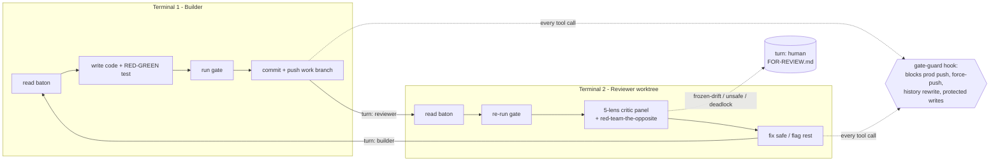

# autonomy-loop

**Two Claude Code terminals on one repo — a builder and an adversarial reviewer — passing a git baton through a frozen-invariant safety gate.** A Claude Code plugin you drop into any project and tune from one config file.

> Honest framing up front: the *idea* of a self-driving builder/reviewer loop is not new (see [Prior art](#prior-art)). What this gives you is a **specific, opinionated discipline** — an adversarial multi-lens reviewer, a *frozen-invariant* gate, and a no-fabrication rule — wired together and tunable per project. The value is in the constraints, not the novelty.

---

## What it actually is

Two terminals run `claude` in a `/loop` against the **same repo on different git worktrees**:

- **Terminal 1 — Builder.** Picks up the next task, writes code + a RED-before/GREEN-after test, runs the gate, commits to the work branch, hands off.
- **Terminal 2 — Reviewer.** Re-runs the gate itself, spawns a **5-lens critic panel** (correctness · honesty · regression · security · UX), red-teams the opposite, fixes what's safe, flags the rest, hands back.

They never talk in chat. The only shared state is a committed markdown file — **`LOOP-STATE.md`** — that holds the baton (`turn:`, `last-builder-sha`, `last-reviewed-sha`, the next instruction each way). State lives in git, so a crash just resumes from the last commit.



## Why you might want it

- **The reviewer is adversarial by construction.** Its only win condition is finding fault. It re-runs the gate from scratch (never trusts the builder's "tests pass"), spawns role-specialized critics, and must argue *why the change is wrong* before it's allowed to approve.
- **A frozen invariant the loop can't quietly re-baseline.** You declare what must stay byte-identical (golden/snapshot tests, a recorded API contract). Drift requires a human GO — the loop escalates, it doesn't overwrite.
- **A no-fabrication rule.** Every number a build emits must carry its sample size + interval, or say "building — N/30." A capability with no real data abstains *visibly* instead of inventing a plausible value.
- **Cost-aware.** Critics run on a cheap model in parallel; the expensive judge is only invoked when a wave escalates. See [Cost](#cost).
- **Portable.** One `autonomy.config.json` drives the branch names, gate commands, models, protected paths, and honesty rule. The plugin is project-agnostic.

## Install

```bash
# 1. add this repo as a plugin marketplace, then install
claude plugin marketplace add https://github.com/inferencegod/autonomy-loop
claude plugin install autonomy-loop

# 2. in your project, scaffold the config + baton
/autonomy-loop:autonomy-init

# 3. edit autonomy.config.json (branches, gate commands, protected paths), then:
#    Terminal 1:  claude  ->  /autonomy-loop:builder   ->  /loop 600
#    Terminal 2 (in the review worktree):  claude  ->  /autonomy-loop:reviewer  ->  /loop 600
```

`/loop 600` = self-schedule every 600s (10 min). Commands are namespaced `/autonomy-loop:<command>`.

## Operate (first run)

A minute of setup avoids the common failure modes:

- **Two terminals, not one.** The whole model is a builder and a reviewer passing a baton. One terminal is not the loop.
- **The reviewer runs in its own git worktree.** `/autonomy-init` hands you the exact `git worktree add` command; run the reviewer from there so the two never step on each other.
- **Start green.** Make sure your test/build/lint pass on a clean checkout before you launch. The gate reverts any wave that goes red, so a repo that starts red will look like the loop is undoing your code.
- **Approve the first task.** After init the baton sits at `turn: human`; flip it to `turn: builder` to start. Nothing runs until you do.
- **How to stop it.** Set `turn: human` in `LOOP-STATE.md` (or cancel the `/loop`). Both terminals exit on the next tick.
- **It costs tokens.** Two agents looping continuously is the point. Tune `loopIntervalSec` up if you do not need a 10-minute cadence, and the built-in `breaker` (in the config) parks the loop after a hard epoch cap or a run of no-progress waves so it cannot burn unattended forever.

## Configure

Copy `autonomy.config.example.json` -> `autonomy.config.json` at your repo root (it's gitignored — per-checkout). Key knobs:

| knob | what it does |
|---|---|
| `workBranch` / `prodBranch` | the loop only ever pushes `workBranch`; `prodBranch` is gated |
| `worktreePath` | where Terminal 2's worktree lives |
| `gate.test` / `gate.build` / `gate.lint` | your real commands — the reviewer re-runs them |
| `gate.coverage` | optional third gate: a command that emits a coverage summary; the reviewer ratchets coverage so it can never silently drop (see [Coverage ratchet](#coverage-ratchet-the-third-gate)) |
| `gate.frozenInvariant` | what must stay byte-identical without a human re-baseline |
| `protectedPaths` | edits **and** shell writes (`rm`/`mv`/`cp`/redirect/`sed -i`) here are blocked by the hook; the defaults also protect the loop's own config, coverage baseline, and hooks so it cannot disarm itself |
| `models.builder` / `reviewerCritics` / `reviewerJudge` | builder + cheap critics + escalation judge |
| `honestyRule` | the anti-fabrication contract injected into both prompts |

## Safety model & limitations

**Read this before you trust it.** The `gate-guard` PreToolUse hook is a **defense-in-depth tripwire, not a sandbox.** It catches the *common-case* dangerous actions and returns a structured denial the model can act on (escalate to a human), instead of crashing the agent.

What it blocks today (with unit tests in [`autonomy-loop/test/gate-guard.test.mjs`](autonomy-loop/test/gate-guard.test.mjs)): pushes/fast-forwards to `prodBranch` (including `HEAD:refs/heads/...` refspecs), force-push, history rewrite / `reset --hard` / `--mirror`, `gh` PR-merge/release/workflow shipping, and edits **or** shell writes/deletes targeting `protectedPaths`.

What it **cannot** do — be honest with yourself:

- A regex over shell commands cannot anticipate every trick (novel tools, exotic git refs, a script that writes a script). Treat it as a seatbelt, not a vault.
- PreToolUse hooks are **not reliably enforced for sub-agent tool calls** — a spawned agent may bypass the hook. Don't rely on it as your only barrier.
- If `autonomy.config.json` is missing/unparseable, the hook prints a **visible warning** and falls back to universal git guards only (`protectedPaths` are *not* enforced). It fails loud, not silent — but it does fail open on paths.

**Real backstops** (use them in addition, not instead): server-side **branch protection** on `prodBranch`, **read-only file permissions** on golden/frozen files, and running the loop in a **container / disposable checkout**. The hook reduces blast radius; your infra is what actually contains it. `/autonomy-init` now checks `prodBranch` protection and offers to set a ruleset (require a PR, block force-push, block deletion); it warns and continues if it cannot, so the server-side rail is set up at init rather than assumed.

## Coverage ratchet (the third gate)

The builder writes a RED-before-green test for each change, and the reviewer runs the per-fix **bite** (now a real gate, [`hooks/bite.mjs`](autonomy-loop/hooks/bite.mjs)): it reverts the change in a throwaway worktree, reruns the test, and requires an assertion failure, so a test that still passes when the fix is reverted fails the gate (an exit code is not treated as a valid RED, and a flake guard reruns N times). That proves every *new* test catches its own bug. It says nothing about the rest of the tree slowly losing coverage over hundreds of waves. The coverage ratchet closes that gap. Line and branch coverage each sit on their own floor in the stored baseline (`.autonomy-coverage.json`), floored independently and only ever ratcheting up, so holes cannot quietly pile up wave after wave. A new conditional whose else-arm is never tested is caught by the branch floor even when the line number holds.

This is the drift layer; the bite is the assertion layer, and they ship together on purpose. Line coverage measures execution, not assertions (a suite with every assert deleted still scores 100%), so the ratchet is never a quality claim on its own. Pairing a coverage ratchet with a per-change bite as a built-in loop invariant is the part no mainstream coding agent ships today. The pieces exist as CI a human wires up, never inside the agent's own loop.

It is opt-in. Set `gate.coverage` to a command that writes an Istanbul `coverage-summary.json`:

```jsonc
// autonomy.config.json
"gate": { "coverage": "c8 --reporter=json-summary --reporter=json --reporter=text npm test", "patchTarget": 100 }
```

The reviewer then runs the bundled script, which blocks any wave that lowers coverage and bumps the floor on a real improvement:

```bash
node "$CLAUDE_PLUGIN_ROOT/hooks/coverage-ratchet.mjs"   # reads coverage/coverage-summary.json + .autonomy-coverage.json
```

The pure decision core lives in [`autonomy-loop/hooks/coverage-ratchet.mjs`](autonomy-loop/hooks/coverage-ratchet.mjs), unit-tested in [`autonomy-loop/test/coverage-ratchet.test.mjs`](autonomy-loop/test/coverage-ratchet.test.mjs). Leave `gate.coverage` empty to skip it.

A fourth gate, patch coverage, is opt-in via `gate.patchTarget` (0 off, 80 standard, 100 strict). It scores only the lines a wave changed, so new untested code cannot hide behind a flat global percent, the ratchet's blind spot. It reuses the same coverage run (add `--reporter=json` so `coverage-final.json` is emitted) and lives in [`autonomy-loop/hooks/patch-coverage.mjs`](autonomy-loop/hooks/patch-coverage.mjs), unit-tested in [`autonomy-loop/test/patch-coverage.test.mjs`](autonomy-loop/test/patch-coverage.test.mjs). The ratchet stops the whole tree eroding; patch coverage proves the code each wave just wrote is itself tested.

Coverage works out of the box if your repo already reports it (jest or vitest with their coverage provider, or `node --test` on Node 22+, which emits the Istanbul summary); otherwise add a tool like `c8`. With no coverage tool the third and fourth gates simply stay off and the loop still runs on the bite, the reviewer, and the safety hook.

## Cost

This burns tokens — two agents running continuously is the point. To keep it sane:

- Critics default to a **cheap model in parallel**; the **Opus-class judge fires only on escalation** (frozen-drift, protected-path, or a split panel). Most waves never touch it.
- Effort is **scaled to the diff**: pure-doc/trivial waves get one quick pass, not the full panel.
- Tune `loopIntervalSec` up if you don't need 10-minute cadence.
- The "model" knobs are **labels written into prompts, not a runtime switch** — set the actual model when you launch each terminal (`claude --model ...`). The config keeps them consistent; it doesn't enforce them.

## When NOT to use this

- One-off scripts or throwaway prototypes — the ceremony isn't worth it.
- Repos with no meaningful test/build gate — the reviewer has nothing to stand on.
- Anything where an agent pushing to a shared branch unattended is unacceptable, even gated.
- If you won't set up the real backstops above, run it only on a disposable checkout.

## Prior art

Self-driving and review-loop patterns are a crowded space, and this stands on them. Anthropic ships first-party `/loop`, hooks, and agent-team primitives; the community has shipped builder/reviewer and "keep going" loops (e.g. claude-review-loop, autoloop, the Ralph Wiggum pattern). This project's contribution is the *combination*: an adversarial multi-lens reviewer + a human-gated frozen invariant + a no-fabrication discipline + per-project config, packaged as one installable plugin. If you've built something similar, I'd genuinely like to compare notes.

## License

MIT — see [LICENSE](LICENSE).
